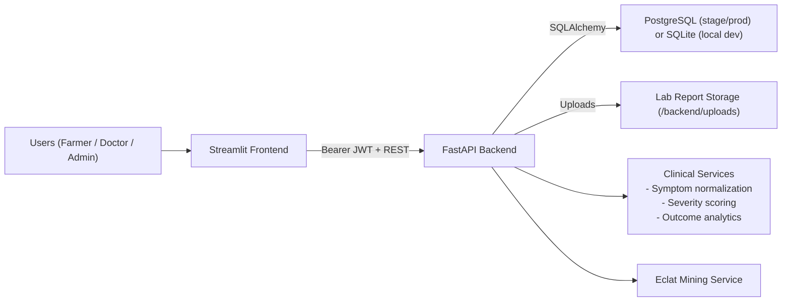

# Architecture Overview

## Layers
- Presentation: Streamlit role-based portals and workflows.
- API: FastAPI endpoints with validation, pagination, and error schema.
- Domain services: prediction rules, Eclat mining, clinical intelligence.
- Persistence: SQLAlchemy models + Alembic migrations.
- Platform: observability middleware, RBAC, backup/restore scripts, CI pipeline.

## Security Model
- Authentication: JWT bearer token.
- Password storage: bcrypt hashes.
- Authorization: role guard middleware + endpoint role dependencies.
- Cross-origin policy: env-driven allowlist (`CORS_ALLOWED_ORIGINS`).

## Reliability Controls
- Health endpoint: `/health`
- Readiness endpoint: `/ready`
- Structured request logs with `request_id` in responses and logs.
- Migration-controlled schema changes via Alembic revisions.

## Test & Delivery
- Test layers: unit, integration, negative tests under `backend/tests`.
- CI pipeline: `.github/workflows/ci.yml` (install, migrate, test).
- Environments: `.env.example`, `.env.stage`, `.env.prod` + compose overlays.
